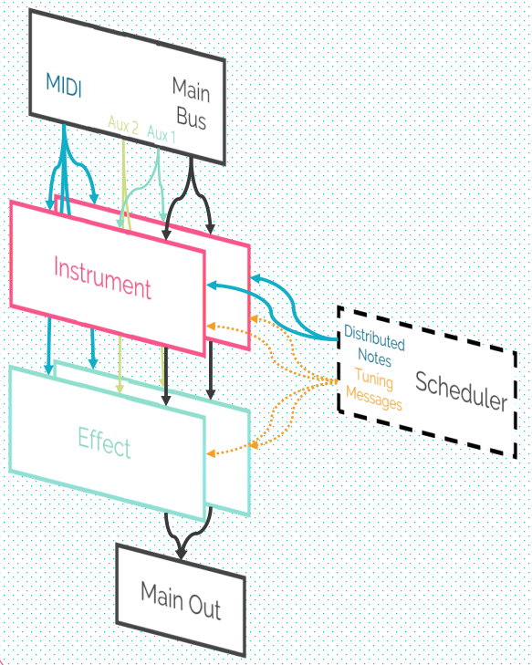
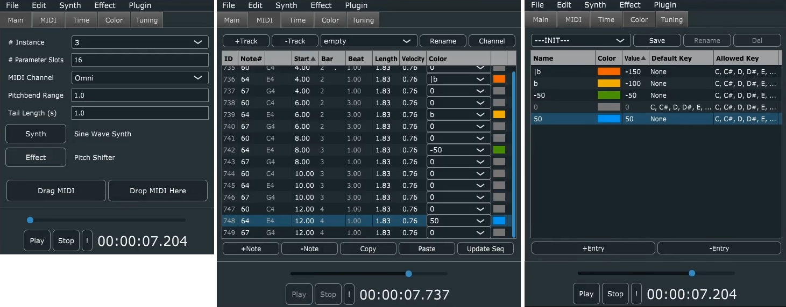

# MicroChromo

  

Enabling *all* (well almost lol) VST instruments to work with microtuning. Inspired by Dr. Dolores Catherino's works on PloyChromatic Music, this program is essentially a wrapper around other instruments. Adding *color* to MIDI notes, which is then distributed to multiple instances of the same instrument with correct tuning. This design enables products without individual pitch bend capability or microtuning support to play microtonal pieces as well.

## Signal Flow Diagram

  

## GUI

  

